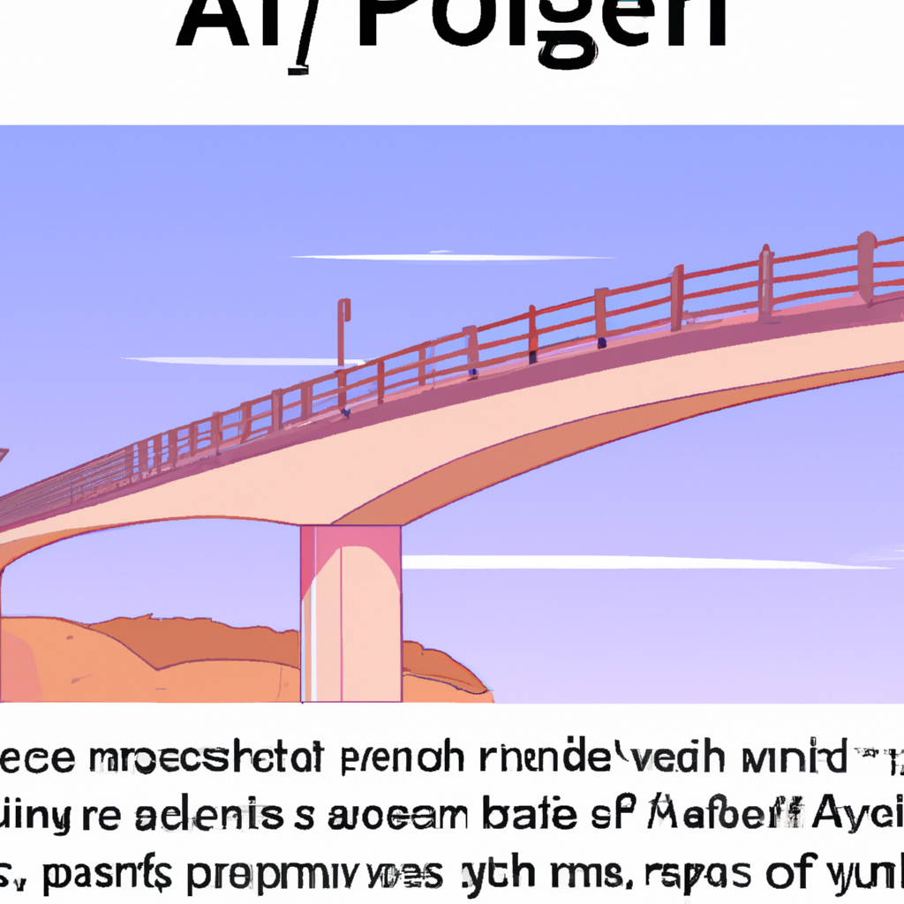

# OpenAI Bridge

A bridge between Eastern Rome and OpenAI in PHP.

## API

### Get Models

URL: SCHEMA://DOMAIN/bridge/OpenAiApiV1/getModels

### Completion

URL: SCHEMA://DOMAIN/bridge/OpenAiApiV1/completion

### Generate Image For Url

URL: SCHEMA://DOMAIN/bridge/OpenAiApiV1/generateImageForUrl

### Generate Image Directly for download

URL: SCHEMA://DOMAIN/bridge/OpenAiApiV1/generateImageForOutput